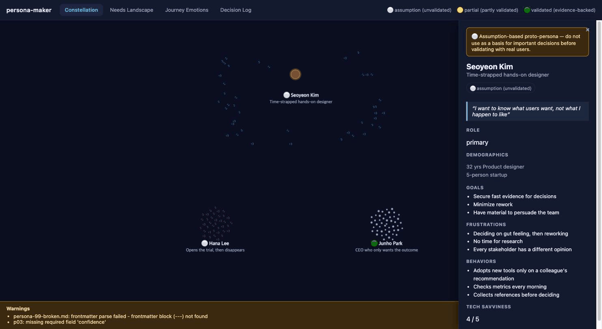
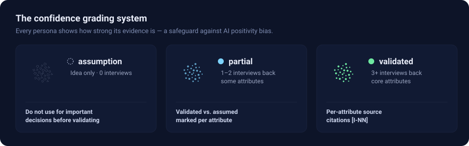
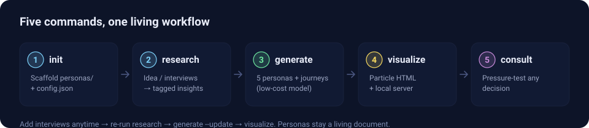

<div align="center">



**Turn ideas and interviews into confidence-graded personas, journey maps, and particle visualizations — then pressure-test every decision from your users' perspective.**

A [Claude Code](https://claude.com/claude-code) plugin (+ a Codex adapter) for designers, developers, and PMs.

[Install](#install) · [Quick start](#quick-start) · [How it works](#how-it-works) · [Why confidence grades](#why-confidence-grades) · [Contributing](CONTRIBUTING.md)

[](LICENSE)
[](tests/)
[](core/visualizer/)

</div>

---

## Demo

The visualization is a **self-contained single HTML file** (Canvas 2D, zero external dependencies). Four scenes, each answering one question about your users:



---

## Why this exists

Designers and developers make product decisions on taste and gut feeling — and that causes rework and churn. persona-maker gives you a **user-perspective decision anchor** grounded in research best practices, so you decide from what users want, not what you happen to like.

The catch with AI-generated personas is well documented: LLMs skew them toward more successful, agreeable, homogeneous people than reality (*positivity bias* and *identity flattening*). persona-maker defends against this on two fronts — generation rules (every persona must have ≥3 decisions it would push back on, a real avoidance behavior, and a non-all-positive emotion curve) **and** an explicit confidence grade on every persona.

## Why confidence grades



Every persona carries a grade that says how strong its evidence is. Add interviews and `generate --update` promotes grades **without regenerating everything** — demoting them if a new interview contradicts an assumption. Personas are a **living document**, not a one-shot artifact.

| Grade | Condition | In the visualization |
|-------|-----------|----------------------|
| ⚪ `assumption` | Idea only, 0 interviews | Faint **dashed** particles + "don't decide on this yet" banner |
| 🟡 `partial` | 1–2 interviews back some attributes | Validated vs. assumed marked per attribute |
| 🟢 `validated` | 3+ interviews back core attributes | Solid bright particles + per-attribute `[I-NN]` citations |

## How it works



| Command | What it does |
|---------|--------------|
| `/persona-maker:init` | Scaffold `personas/` + `config.json` |
| `/persona-maker:research` | Idea or interview notes → evidence-tagged insights |
| `/persona-maker:generate` | 5 personas (primary 1 + secondary 3 + anti 1) + journey maps |
| `/persona-maker:visualize` | Build the particle HTML and open a local server |
| `/persona-maker:consult` | Ask the personas how they'd react to a decision |

The four visualization scenes:

- **Constellation** — every persona as a particle cluster; confidence is the visual language (dashed/faint = assumption, solid/bright = validated). Click a cluster for the full card.
- **Needs Landscape** — needs/frustrations merged into nodes sized by how many personas share them, so the most common pain point is obvious at a glance.
- **Journey Emotions** — each persona's 5-stage emotion curve, with the low point auto-marked as an "opportunity."
- **Decision Log** — accumulated consultations, personas splitting into accept / neutral / reject, with a disclosure when the basis includes assumption-grade personas.

## Install

**Claude Code:**

```
/plugin marketplace add jcmaker/persona-maker
/plugin install persona-maker@persona-maker
```

**Codex:** register [`codex-skill/SKILL.md`](codex-skill/SKILL.md) as a skill. Same workflow; the default generation model is `gpt-5-mini` instead of `haiku`.

## Quick start

```
/persona-maker:init
/persona-maker:research   I'm building an inventory & ordering app for solo cafe owners…
/persona-maker:generate
/persona-maker:visualize
```

That gets you 5 personas (all ⚪ assumption at first — the dashed particles keep reminding you the evidence is still a guess), journey maps, and the live visualization. Then, after real interviews:

```
/persona-maker:research    (paste interview notes — participants stored by alias)
/persona-maker:generate --update    (⚪ → 🟡 → 🟢, only changed cards rewritten)
/persona-maker:consult     Should onboarding force sign-up, or offer a guest mode?
```

## Language

The plugin's instructions are in English, but **output follows your language**. `init` sets `config.language` to whatever language you're speaking (falling back to `en`), and every generated artifact — cards, journey maps, consultations — is written in that language. Change it anytime in `personas/config.json`.

## Configuration — `personas/config.json`

| Key | Default (Claude / Codex) | Description |
|-----|--------------------------|-------------|
| `model` | `haiku` / `gpt-5-mini` | Low-cost model for bulk generation & consultation judgment |
| `persona_count` | `5` | Total personas (3–10) |
| `language` | your language (`en` fallback) | Output language |

**Cost design:** judgment work (slot design, validation, grade re-evaluation) runs on the main session; only bulk text generation goes to the low-cost model, one subagent per persona in parallel.

## Repository layout

```
.claude-plugin/      plugin.json + marketplace.json
commands/            /persona-maker:* command wrappers
skills/              init · research · generate · visualize · consult
agents/              persona-generator (haiku, generation-only)
core/
├── methodology/     persona, journey, confidence, interview-analysis rules (single source of truth)
├── templates/       artifact markdown templates
└── visualizer/      build.py (Python, stdlib only) + template.html (Canvas 2D, zero deps)
scripts/             serve.sh (Bash) · smoke_template.mjs (Node)
codex-skill/         single-file Codex adapter
tests/               pytest suite + fixtures
```

## Development

```bash
python -m pytest tests/ -v                        # builder tests (9)
node scripts/smoke_template.mjs                   # template integrity (marker/JSON/JS/self-contained)
python3 core/visualizer/build.py --personas-dir tests/fixtures/personas --output /tmp/preview.html
bash scripts/serve.sh tests/fixtures/personas     # (after building) local server
```

Design docs live in [`docs/superpowers/`](docs/superpowers/); the product requirements are in [`PRD.md`](PRD.md).

## Contributing

Issues and PRs welcome — see [CONTRIBUTING.md](CONTRIBUTING.md). Good first areas: new visualization scenes, additional methodology checks, and adapters for other agent runtimes. The methodology under `core/methodology/` is the single source of truth; the Claude and Codex adapters only differ in how they dispatch models.

## License

[MIT](LICENSE)
